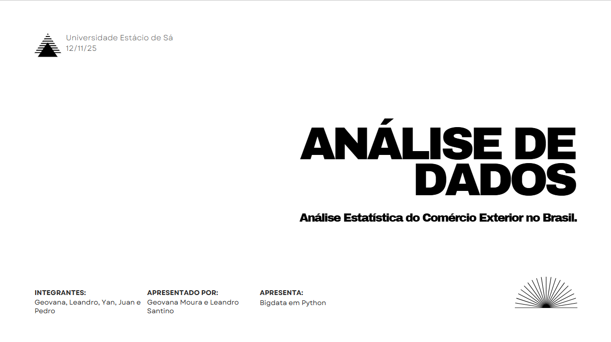

# Análise Estatística do Comércio Exterior no Brasil.

## 📊 Apresentação dos Resultados

**🎯 Clique na imagem acima para acessar o relatório completo**

---

## Objetivo
A análise integrada entre as estatísticas do comércio exterior e a variação cambial busca compreender como as oscilações do câmbio influenciam o desempenho das exportações e importações brasileiras. Essa relação é essencial para apoiar empresas exportadoras na formulação de estratégias mais seguras diante da volatilidade do mercado internacional.  

O estudo visa identificar:
- Como a variação do câmbio impacta os volumes e valores negociados;
- Quais setores e produtos são mais sensíveis às flutuações cambiais;
- A evolução das trocas comerciais com os principais parceiros (América do Norte, Europa e Ásia) entre 2017 e 2024;
- Estratégias de decisão em períodos de crise, considerando blocos econômicos e categorias de produtos.

---

## Metodologia
A análise combina dados do **Comex Stat (MDIC)** — com informações sobre exportações e importações — e dados do **Banco Central do Brasil (BCB)** referentes à taxa de câmbio.  

### Etapas:
1. **Coleta e integração dos dados**  
   - Download dos CSVs do Comex Stat (produtos, países, valores, quantidades).  
   - Requisição à API do BCB para obtenção da série histórica da taxa de câmbio (2017–2024).  

2. **Limpeza e organização**  
   - Padronização de colunas, datas e unidades.  
   - Tratamento de valores ausentes e eliminação de duplicidades.  

3. **Análise exploratória**  
   - Agrupamento por blocos econômicos e seções de produtos.  
   - Cálculo de médias, variações percentuais e correlação entre o câmbio e o valor exportado/importado.  

4. **Visualização dos resultados**  
   - Geração de gráficos interativos para facilitar a interpretação dos dados.  
   - Comparação entre períodos de valorização e desvalorização do real.

---

## Base de Eventos e Visualizações

Os principais eixos de análise e visualização considerados são:

- **Parcela do mercado em relação às categorias de produto**  
  - Representada em **gráfico de pizza**, destacando a participação percentual de cada tipo de produto exportado e importado.

- **Parcela do mercado em relação ao bloco econômico**  
  - Apresentada em **gráfico de barras**, permitindo observar a representatividade de blocos como Ásia, Europa, América do Norte e Mercosul.

- **Parcela do mercado em relação ao país**  
  - Exibição dos **TOP 5 países** com maior valor de importação e exportação, evidenciando os principais parceiros comerciais do Brasil.

- **Evolução do mercado no intervalo de tempo (2017–2024)**  
  - Demonstrada por **gráfico de linhas**, analisando o comportamento temporal das exportações, importações e da taxa de câmbio.

---

## Períodos de Análise Econômica

Para compreender melhor o impacto de eventos globais sobre o comércio exterior e o câmbio, foram definidos três períodos de análise:

- **Situação do mercado Pré-Covid (2017–2019)**  
  Avaliação do comportamento do comércio exterior antes da pandemia, considerando estabilidade cambial e crescimento gradual das exportações.

- **Situação do mercado Durante a Covid-19 (2020–2021)**  
  Análise dos efeitos da pandemia sobre o câmbio, interrupções logísticas e variações na demanda internacional.

- **Situação do mercado durante a Guerra da Ucrânia (2022)**  
  Investigação do impacto do conflito geopolítico sobre os fluxos comerciais, preços de commodities e instabilidade cambial.

Esses marcos históricos permitem identificar correlações entre eventos econômicos e oscilações cambiais, oferecendo uma leitura contextualizada da evolução do comércio exterior brasileiro.

---

## Resultados Esperados
- Identificação de setores com maior **sensibilidade ao câmbio** (como commodities e manufaturados).  
- Avaliação do impacto das crises econômicas sobre as exportações e importações.  
- Geração de **insights estratégicos** que auxiliem empresas a definir preços, mercados prioritários e políticas de hedge cambial.  

---

## Conclusão
Ao unir a análise estatística do comércio exterior com a variação cambial, é possível compreender melhor o comportamento do mercado internacional e antecipar tendências.  

Esse processo transforma dados históricos em inteligência de mercado, permitindo decisões mais proativas e fundamentadas no contexto econômico global.
